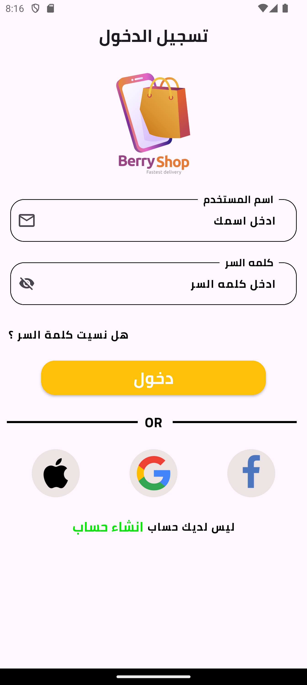
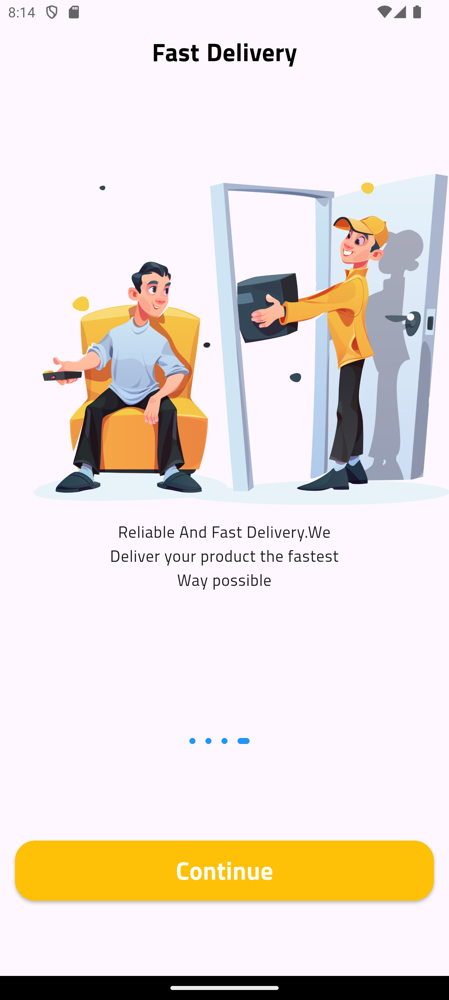

# 🛒 E-Commerce Mobile App

A scalable and modern e-commerce mobile application built with Flutter, featuring product browsing, cart management, authentication, and backend integration using PHP & MySQL.

# 🚀 Features

- 🔐 User Authentication

- 🛍 Browse Products by Categories

- 🔎 Product Search

- 🧾 Product Details Page

- 🛒 Add to Cart

- 🌍 Localization Support

- 🏗 Clean Architecture Implementation

- 🔗 REST API Integration

# 🛠 Tech Stack
📱 Frontend

- Flutter

- Clean Architecture

- 
State Management (Getx)

- Localization

🖥 Backend

- PHP

- MySQL

- RESTful APIs

# 🏗 Architecture

The application follows MVC principles:

- Controller Layer

- Data Layer

- View Layer

This structure improves scalability, maintainability, and testability.

# 📂 Project Structure
```text
lib/
 ├── core/
 ├── bindings
 ├── features/
 │    ├── auth/
 │    ├── home/
 │    ├── cart/
 │    ├── product/
 └── main.dart
```
# 📦 Installation & Setup
1️⃣ Clone the Repository
git clone https://github.com/Mafdysaad/BerryCart-.git
cd ecommerce-app

2️⃣ Install Dependencies
flutter pub get

3️⃣ Backend Setup

- Install XAMPP or any Apache server

- Import the provided database file into MySQL

- Configure database credentials in config.php

- Update API base URL inside the Flutter project

4️⃣ Run the App
flutter run
# 🎯 Project Purpose

- This project demonstrates:

- Full mobile app development lifecycle

- Backend integration

- Authentication flow implementation

- Clean Architecture usage

- Localization support

- API handling and error management
## Screenshots
<div style="display: flex; gap: 10px;">



</div>
